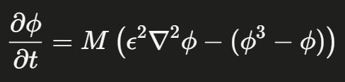

# Physics Informed Neural Network (PINN)
Solving the Allen–Cahn phase field equation using a **Physics Informed Neural Network** from scratch. With no simulation data required. This network will learn the solution
ϕ(x,t) purely by minimizing the PDE residual, initial condition error, and boundary condition error combined as a composite **loss function**.

# Problem Statement

Can a neural network learn to solve the Allen–Cahn equation, which governs phase separation. All while, without using any labelled simulation data, using only the physics embedded in the PDE as a training signal? 

This is what makes it physics informed.

Following is the Allen-Cahn equation:

# Motivation
Traditional PDE solvers (Finite Difference Method, Finite Element Method) discretize space and time on a grid. PINNs offer a mesh free alternative. Here our neural network is like a continuous function approximator for ϕ(x,t), trained on the **physics of the problem**. 

This project demonstrates how modern deep learning can be implemented directly with materials science to solve governing equations.

# Methodology
The PINN takes a collocation point (x,t) as input and outputs the predicted phase field Network Architecture

Fully connected MLP : [2 → 64 → 64 → 64 → 64 → 1]

Activation : tanh (smooth, double differentiable, needed for second order PDE derivatives)
~12,900 trainable parameters

# About me
Neel Patel — B.Tech in Materials Science, IIT Hyderabad
ms24btech11024@iith.ac.in